# ERR Fitness

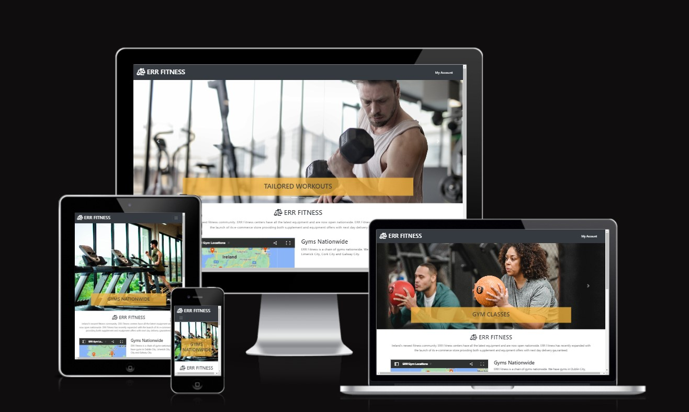

[Live application can be found here](https://err-fitness.herokuapp.com/)

This is a full-stack e-commerce project built using Django, Python, HTML, CSS and JavaScript. I have created a website for 'ERR Fitness' a fictional chain of gyms. The gym is also trying to grow their recently created e-commerce store that and allows customers to purchase gym equipment for working out at home and supplements for before and after workouts. Customers can write a review for any product once they have created an account.

## Table of Contents
1. [**UX**](#ux)
    - [**Strategy**](#strategy)
    - [**User stories**](#user-stories)
    - [**Scope**](#scope)

2. [**Features**](#features)

3. [**Technologies Used**](#technologies-used)

4. [**Testing**](#testing)

5. [**Deployment**](#deployment)

6. [**Credits**](#credits)

---
## UX

## Strategy
Using the core UX principles I first started with Strategy, thinking about the target audience for this e-commerce store and the features they would benefit from.

The target audience for 'ERR Fitness' are:
- Students, interested in sports, interested in health and wellbeing, recently retired
- 16 to 35 year olds, 55 to 70 year olds

These users will be looking for:
- An informative website, that is easy to use and easy to purchase items
- Ability to view items that are for sale
- Read and write reviews for items they have purchased or are considering purchasing
- User account functionality to view past orders and store billing information

It is assumed that there will be an even split between users viewing the website on their mobiles phone and laptops. Creating a responsive is integral to the website design. Bootstrap grids and elements & custom CSS was used for this purpose.

## User Stories

See defined user stories [here](https://github.com/users/juliandunne1234/projects/18/views/3)

### **Epic 1 - Website Layout and Navigation**:
1. As a user I can easily scroll through items by equipment and supplement so that I can see what is available in the store
2. As a user I can view individual products so that I can see individual plans or products details
3. As a user I can see cost of items in my shopping bag so that I can remain within budget
4. As a user I can purchase excercise equipment and supplements without logging in so that I use the store without subscribing

### **Epic 2 - Subscription and User Accounts**:
5. As a user I can create and account and login so that write a product review
6. As a user I can recieve email confirmation so that I can verify my account registration
7. As a user I can reset my password so that I can login to my account if I forget my password

### **Epic 3 - Puchasing Items**:
8. As a user I can see the products in my shopping bag so that I can add/remove as required prior to making a purchase
9. As a user I can recieve a confirmation email from the seller so that I can be sure the purchase completed successfully

### **Epic 4 - Admin**:
10. As a admin user I can add and remove items from the store so that I can update the store inventory

## Scope

In order to achieve the desired user & business goals, the following features will be included:

- Responsive navbar to login/register
- Shoping cart displaying total cost for items selected including the standard delivery charge
- Landing page with informative image carousel
- Products page, that allows user to scroll through items available for purchase.
- My Profile page, for logged in users to update their details which in turn updates the user model. User is also able to view their previous orders and wishlist.
- Register/login feature using Django AllAuth so that users can create an account.
- Edit/Delete functionality so that ERR Store items can be added/removed from the website.
- Write a review of ERR Store items functionality so that customers can share their experience with other potential customers

### Databases

The Elephant SQL database has been used for all database models: 

#### **Profiles App**

Profiles app allows authenticated users to save their information so that when a user is logged in the order form is pre-populated with their userprofile information, creating an improved user experience. The `UserProfile` model has a one-to-one field that is linked to the Django AllAuth user account, upon logging in the model method `create_or_update_user_profile` creates the profile if it isn't already present in the model.

#### **Products App**

Products app controls the products that are available  to purchase using the models `Product`, `Category` & `Review`.

`Product` allows adding/removing of products with the database. Only admin users are able to access this functionality and it can be done from the front end using the `add_product` view.

`Category` is for the ERR Store item based on whether it is gym equipment or a supplement. 

`Review` allows logged in users to write a review of any of the store items. Users that are not logged in can only read the reviews.

#### **Checkout App**

Checkout app is used to purchase items from website using the models, `Order` & `OrderLineItem`. 

`OrdeLineItem` contains information regarding the products that have been purchased as part of a specific order. It has a foreign key to `Product` & `Order`, it also contains the quantity purchased of that product and then the item total. This is then used to calculate the total cost for the order.

`Order` contains all of the relevant information for billing/shipping, a foreign key to the `UserProfile`. An order number is automatically generated when a new order is added to the database using `UUID`.

#### **Workout_plan App**

Workout app is used to create different daily workouts using the models,  `WorkoutCategory`, `DayOfWeek` & `WorkoutPlan`.

`WorkoutCategory` is for the type workout and includes a brief summary.

`DayOfWeek` is for days of the week.

`WorkoutPlan` contains a foreign key to the `WorkoutCategory` and a one to one field to `DayOfWeek`. It also includes a workout time duration field. This model is used by the workout plan page whereby the superuser can change the workout type and workout duration from the UI.

---

## Features

### Navbar

A fixed navbar remains at the top of each webpage at all times, allowing the user to login/register/logout from the website. The navbar is responsive and collapses the menu for smaller screen sizes. The options displayed vary depending on if the user is logged in and the access level that their account allows.

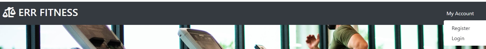

On mobile, the navbar is collapsed:

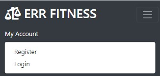

There is also a shopping bag with the order total including standard delivery charge displayed whenever items have been added to the bag.

### Footer

The footer includes a newsletter sign up form that uses Mailchimp and a facebook social media icon that is also a link to the social media site. For the purposes of this project and due to time constraints it was not possible to create a business page. 

### Home page

The home page includes a navbar title to inform the user the webpage is fitness related. There is an animated bootstrap carousel, that displays images with captions describing the services ERR Fitness provides. 

The homepage also includes the following subsections: 
* Introduction with brief summary of the current status of the company
* Embedded iframe of google maps with gym location pins added
* Gym classes - informating user that gym members have access to gym classes and that structured workout plans are made available. Link provided to workout plan page that gives high level daily workout plan
* ERR Store - informing user that gym online store is now open with link to the products page

### All products

This page displays all of the store items for sale. The products are seperated into gym equipment and supplement categories and the user can scroll through each item available in the store. Each item has an image, name, and price.

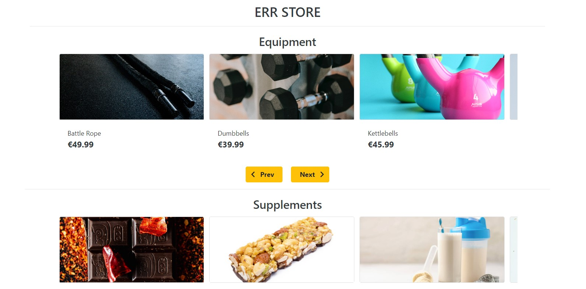

Customers can log in and write a review for products. The reviews are displayed on the product detail page.

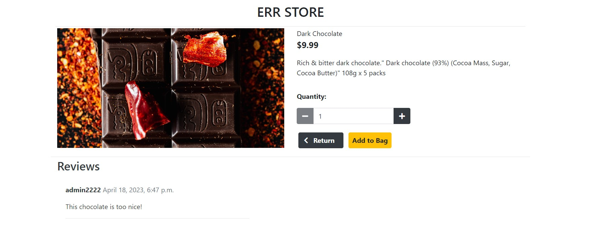

### Workout Plans

This page displays daily workout for each day of the week including the type of workout, duration and can be updated by the superuser when logged in. 

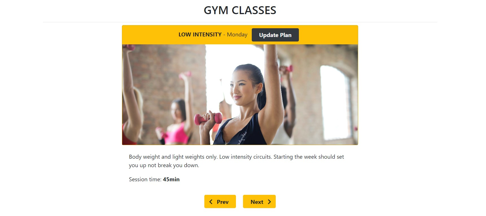

### Bag

The bag page provides an overview of all of the items added by the user. Product information is displayed that includes image, name, photographer, quantity, price and subtotal. The user can drop the item from the bag from this page. There is also buttons to proceed to the checkout or to keep shopping.  

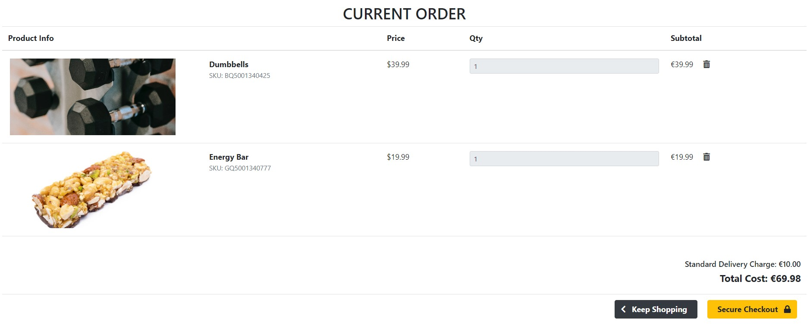

If there is nothing in the bag then the user can select the return to store button.

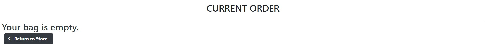

### Checkout

The checkout page is used to complete a purchase. There is a billing & card detail form to populate and a submit button to complete the transaction.

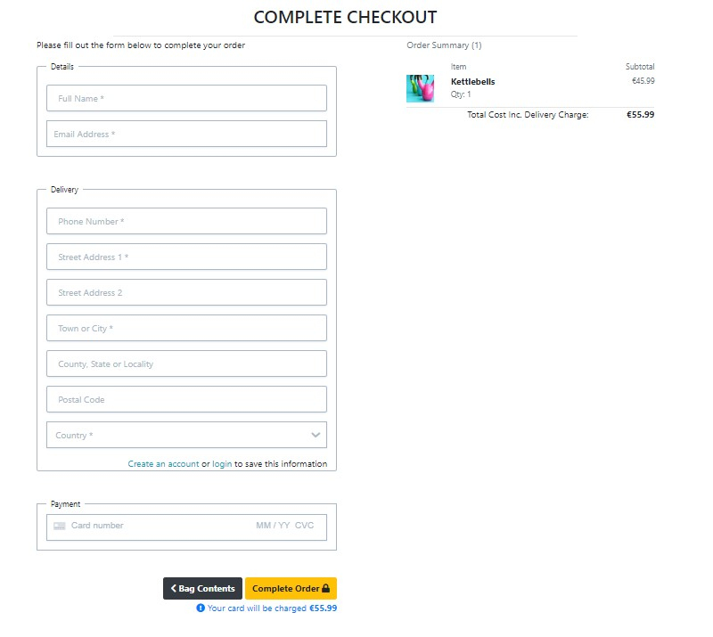

The card payment feature has been built using [Stripe](https://stripe.com/). Payment functionality was tested using the Stripe development payment card details:

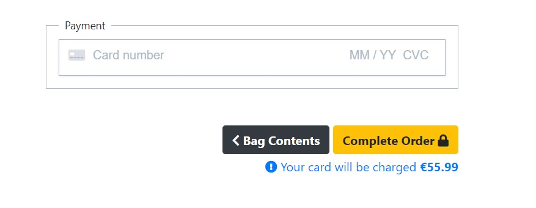

Following the successful completion of a customer order the user is directed to the 'checkout success' page, which displays the order number and delivery details.

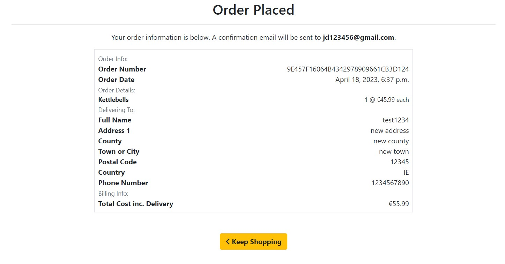

If the payment can not be completed, the form does not submit, and an error message is displayed.

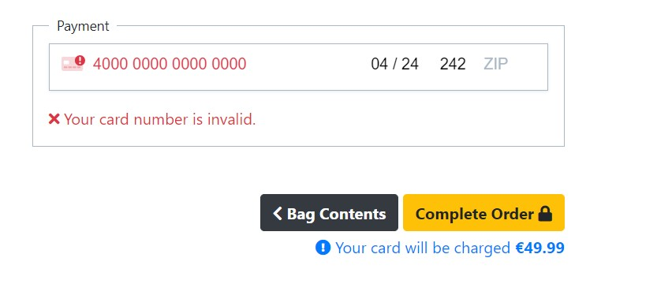

### User profile

A logged-in user can use the `my account` dropdown to select a link to the `My Profile` which contains their account details.

The profile page can be used to update default shipping/billing address and contact information.
A list of all the orders previously made by the user are also displayed.

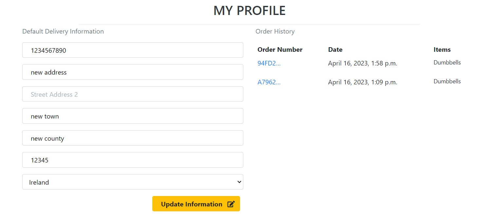

Logged in users can also write a review for items available in the ERR Fitness store.

#### **Product management**

Superusers can remove products from the store using the remove from store link. Products can be added to the store from the `Product Management` page that can be accessed from the `My Account` dropdown.

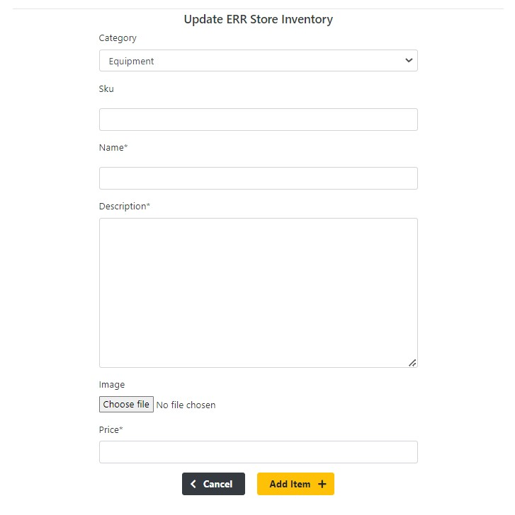

---
## Technologies Used

I have used several technologies that have enabled this design to work:

- [Django](https://www.djangoproject.com/)
    - Django is the framework that has been used to build the website.
- [Python](https://www.python.org/)
    - Python is the programming language used to write all of the backend code.
- [Bootstrap](https://getbootstrap.com/)
    - Used for creating responsive design.
- [Google Fonts](https://fonts.google.com/)
    - Used to obtain the fonts used throughout the website
- [Font Awesome](https://fontawesome.com/)
    - Used to obtain the icons used on the high scores and rules pages.
- [Google Developer Tools](https://developers.google.com/web/tools/chrome-devtools)
    - Used as a primary method of fixing spacing issues, finding bugs, and testing responsiveness across the project.
- [GitHub](https://github.com/)
    - Used to store code for the project after being pushed.
- [Git](https://git-scm.com/)
    - Used for version control by utilising the Gitpod terminal to commit to Git and Push to GitHub.
- [Gitpod](https://www.gitpod.io/)
    - Used as the development environment.
- [Heroku](https://dashboard.heroku.com/apps)
    - Used to deploy my application.
- [Pep8](http://pep8online.com/)
    - Used to test my code for any issues or errors.
- [W3C Markup Validation Service](https://validator.w3.org/) 
    - Used to validate all HTML code written and used in this webpage.
- [W3C CSS Validation Service](https://jigsaw.w3.org/css-validator/#validate_by_input)
    - Used to validate all CSS code written and used in this webpage.
- [JSHint](https://jshint.com/)
    - Used to validate JS code
- [AmIResponsive](http://ami.responsivedesign.is/)
    - Used to generate responsive image used in README file.
- [SQLite](https://www.sqlite.org/index.html)
    - SQLite used to run database tests locally.
- [ElephantSQL](https://www.elephantsql.com/)
    - ElephantSQL relational database used when deploying to Heroku to store the data for all models.
- [AWS](https://aws.amazon.com/)
    - Amazon AWS S3 to store all media files.

---
## Deployment

The master branch of this repository has been used for the deployed version of this application.

### Using Github & Gitpod

To deploy the Django application, I had to use the [Code Institute Python Essentials Template](https://github.com/Code-Institute-Org/python-essentials-template).

- Click the `Use This Template` button.
- Add a repository name and brief description.
- Click the `Create Repository from Template` to create your repository.
- To create a Gitpod workspace you then need to click `Gitpod`, this can take a few minutes.
- When you want to work on the project it is best to open the workspace from Gitpod (rather than Github) as this will open your previous workspace rather than create a new one. You should pin the workspace so that it isn't deleted.
-  Committing your work should be done often and should have clear/explanatory messages, use the following commands to make your commits:
    - `git add .`: adds all modified files to a staging area
    - `git commit -m "A message explaining your commit"`: commits all changes to a local repository.
    - `git push`: pushes all your committed changes to your Github repository.

### Stripe

Stripe was used for setting up payments for the e-commerce store. This required creating a Stripe account and using the [documentation](https://stripe.com/docs/payments/online-payments) provided to add the relevant HTML, python & JS code to the project.

### AWS static and media storage

All static and media files are stored in the cloud using Amazon AWS S3; i have used the same boutique-ado project bucket, user group and user that can access this site and the relevant files. 

### Creating an Application with Heroku

I followed the below steps using the Code Institute tutorial and [Django Blog cheatsheat](https://codeinstitute.s3.amazonaws.com/fst/Django%20Blog%20Cheat%20Sheet%20v1.pdf)

- The following command in the Gitpod CLI will create the relevant files needed for Heroku to install your project dependencies `pip3 freeze --local > requirements.txt`. Please note this file should be added to a .gitignore file to prevent the file from being committed. A `Procfile` is also required that specifies the commands that are executed by the app on startup. 

1. Go to [Heroku.com](https://dashboard.heroku.com/apps) and log in; if you do not already have an account then you will need to create one.
2. Click the `New` dropdown and select `Create New App`.
3. Enter a name for your new project, all Heroku apps need to have a unique name, you will be prompted if you need to change it.
4. Select the region you are working in.

*Heroku Settings*
You will need to set your Environment Variables - this is a key step to ensuring your application is deployed properly.
- In the Settings tab, click on `Reveal Config Vars`. The variables that need to be set are:

*Heroku Deployment using website*
In the Deploy tab:
1. Connect your Heroku account to your Github Repository following these steps:
    1. Click on the `Deploy` tab and choose `Github-Connect to Github`.
    2. Enter the GitHub repository name and click on `Search`.
    3. Choose the correct repository for your application and click on `Connect`.
2. You can then choose to deploy the project manually or automatically, automatic deployment will generate a new application every time you push a change to Github, whereas manual deployment requires you to push the `Deploy Branch` button whenever you want a change made.
3. Once you have chosen your deployment method and have clicked `Deploy Branch` your application will be built and you should see the below `View` button, click this to open your application.

## Credits
Throughout the development of this project the
[Boutique Ado](https://github.com/Code-Institute-Solutions/boutique_ado_v1) walkthrough project was used as a reference and as guidance.